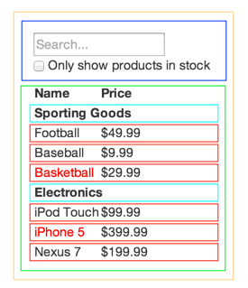
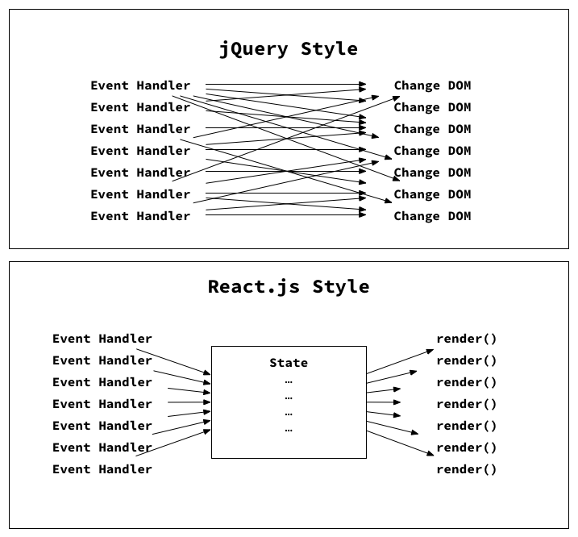
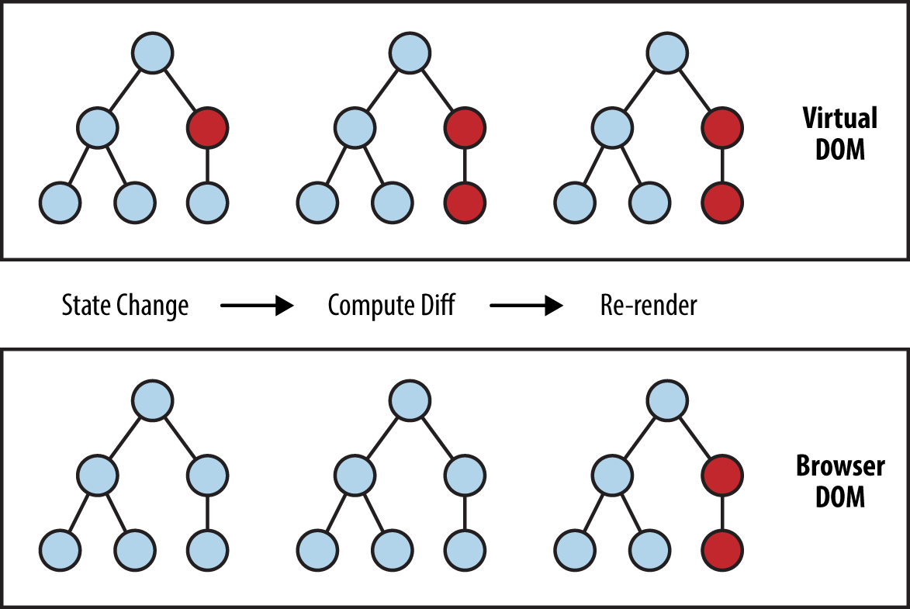

# React Fundamentals

[tsevdos.me](https://tsevdos.me/) / [@tsevdos](https://twitter.com/tsevdos)

---

# Agenda

All the content can be found [here](https://github.com/codehub-learn/react-pfizer).

- what is react
- core principles
- JSX
- components

---

# Rules

Feel free to interrupt me for:

- questions
- relevant comments

---

# What is React

**React is a library for building user
interfaces.**

- virtual DOM
- JSX
- event handling
- performance

---

# Core principles

- composition
- declarative
- unidirectional dataflow
- explicit mutations

---

# Composition

- divide and conquer
- hide complexity
- comes from functional programming

---

# Composition



---

# Composition

```jsx
<Widget>
  <SearchForm />
  <Results>
    <Header />
    <SportsTable />
    <ElectronicsTable />
  </Results>
</Widget>
```

---

# Composition

[twitter.com](https://twitter.com/tsevdos) example

- how UI is going to look
- state

---

# Avatar sample code

```js
function getProfilePhoto(username) {
  return "https://twitter.com/photos/" + username;
}

function getProfileLink(username) {
  return "https://twitter.com/" + username;
}

function getAvatar(username) {
  return {
    photo: getProfilePhoto(username),
    link: getProfileLink(username),
  };
}

getAvatar("tsevdos");
```

---

# Avatar (React code)

```jsx
const ProfilePhoto = (props) {
  return ;
}

function ProfileLink(props) {
  return (
    <a href={"https://twitter.com/" + props.username}>
      { props.username }
    </a>
  );
}
...
```

---

# Avatar (React code)

```jsx
...
function Avatar(props) {
  return (
    <div>
      <ProfilePhoto username={props.username} />
      <ProfileLink username={props.username} />
    </div>
  );
}

<Avatar username="tsevdos" />
```

---

# Imperative and Declarative

- imperative programming is a programming paradigm that uses statements that change a program’s state
- declarative programming is a programming paradigm that expresses the logic of a computation without describing its control flow

---

# Imperative (How)

```js
var numbers = [1, 2, 3, 4, 5];
var total = 0;

for (var i = 0; i < numbers.length; i++) {
  total += numbers[i];
}
```

---

# Declarative (What)

```js
var numbers = [1, 2, 3, 4, 5];
var total = numbers.reduce((total, item) => {
  return total + item;
}, 0);
```

---

# JavaScript built in methods

- map
- reduce
- filter
- find

---

# Declarative

- reduce side effects and mutability
- more clear / readable code
- less errors / bugs

---

# React is declarative

```js
$("#btn").click(function () {
  $(this).toggleClass("active");
  if ($(this).text() === "Active") {
    $(this).text("Inactive");
  } else {
    $(this).text("Active");
  }
});
```

```jsx
<Button onClick="handleClick" isActive={isActive} />;

setIsActive(!isActive);
```

---

# Unidirectional dataflow



---

# Explicit mutations

```js
setName("John");
```

---

# Rendering elements

- React.createElement
- JSX
- virtual DOM

---

# DOM scripting: document.createElement

```html
// file workshop/JSX/00.html

<html>
  <head></head>
  <body>
    <div id="app"></div>
    <script type="text/javascript">
      const rootElement = document.getElementById("app");
      const element = document.createElement("div");
      element.textContent = "Hello World";
      element.className = "container";
      rootElement.appendChild(element);
...
```

---

# React.createElement

```js
// file workshop/JSX/01.html

const rootElement = document.getElementById("app");
const element = React.createElement(
  "div",
  { className: "container" },
  "Hello World"
);

ReactDOM.render(element, rootElement);
```

---

# React.createElement

```jsx
React.createElement(type, [props], [...children]);
```

---

# Virtual DOM

The virtual DOM (VDOM) is an in-memory
representation of real DOM. The representation of a UI is kept in memory and synced with the “real” DOM. It’s a step that happens between the render function being called and the displaying of elements on the screen. This entire process is called reconciliation.

---

# Virtual DOM



---

# React.createElement

```jsx
// file workshop/JSX/02.html

const element = React.createElement(
  "div",
  { className: "container" },
  React.createElement("div", null, "Div 1"),
  React.createElement(
    "div",
    null,
    React.createElement("h2", null, "Title"),
    React.createElement("p", null, "Paragraph inside div 2")
  )
);
```

---

# JSX

```jsx
// file workshop/JSX/03.html

// const element = React.createElement(
//   "div",
//   { className: "container" },
//   "Hello World"
// );

const element = <div className="container">Hello World</div>;
```

---

# JSX

```jsx
// file workshop/JSX/04.html

const element = (
  <div className="container">
    <div>Div 1</div>
    <div>
      <h2>Title</h2>
      <p>Paragraph inside div 2</p>
    </div>
  </div>
);
```

---

# JSX interpolation

```js
// file workshop/JSX/05.html

const title = "Hello World";
const myClassName = "container";

const element = <div className={`${myClassName}-1`}>{title}</div>;
```

---

# Babel transpilation / compilation

- [example](https://babeljs.io/repl#?browsers=&build=&builtIns=false&spec=false&loose=false&code_lz=MYewdgzgLgBATiEUCiAbApgW3WWBeGAExGAFdtcA6Ac3RQwqgCEBPASUIAoAiAQwAd-3AJQBuAFDjQkWFACWUDDALcAEulSoQMAOog4qQtwnToMTCwDCqXhAgA5XtmUxu0qLzlh0cY5NOwGlg4-DAAPIRyAG4wwDZ2jth4AN4ABgAkyRbWtg5O6AC-ALQAjKkFAHzJ8oqFYQD0kVEVokA&debug=false&forceAllTransforms=false&shippedProposals=false&circleciRepo=&evaluate=false&fileSize=false&timeTravel=false&sourceType=module&lineWrap=true&presets=es2015%2Creact%2Cstage-2&prettier=false&targets=&version=7.7.4&externalPlugins=)

---

# Components

- functional components
- props
- children
- conditional rendering

---

# Components

A component is a function or a class which optionally accepts input and returns a React element (or null).

---

# Still JSX (no components)

```jsx
// file workshop/components/00.html

const element = (
  <div classname="container">
    <div>Hello World</div>
    <div>Hello World</div>
  </div>
);
```

---

# Still JSX (no components)

```jsx
// file workshop/components/01.html

const myDiv = <div>Hello World</div>;

const element = (
  <div classname="container">
    {myDiv}
    {myDiv}
  </div>
);
```

---

# Our first functional reusable component

```jsx
// file workshop/components/02.html

const MyDiv = (props) => {
  return <div>{props.msg}</div>;
};

const element = (
  <div className="container">
    <MyDiv msg="Hello World" />
    <MyDiv msg="Welcome to Code.Hub" />
  </div>
);
```

---

# Component rules

User-defined components must be capitalized in JSX (lower-case tag names are considered to be HTML tags).

- <mydiv /> compiles to React.createElement('mydiv') (html tag)
- <Mydiv /> compiles to React.createElement(Mydiv)

---

# Functional component transpilation

- [Babel example](https://babeljs.io/repl#?browsers=&build=&builtIns=false&spec=false&loose=false&code_lz=MYewdgzgLgBATiEUCiAbApgW3WWBeGAExGAFdtcA6Ac3RQwqgCEBPASUIAoAiAQwAd-3AJQBuAFDjQkWAFkWAEQCWANxgF-CfhHUA-GAG9xMeHVJwwMADyFVug5pDbKmCNQC-VgPS2Vuie4SUuDQMOgMOPgwnMbWvjDAqLwQEAByvNh43NJQvEpg6HDcurEmVvLKaq7UWQAS4aggMADqIHCohNwwXiUmZRWqMNVZzeGg2DBQTQDCIITolLWkAEZdPbHeviVikgBK6LzAUAoA8rKUcDjzcJzhWJEANPCI9Pe4YkA&debug=false&forceAllTransforms=false&shippedProposals=false&circleciRepo=&evaluate=false&fileSize=false&timeTravel=false&sourceType=module&lineWrap=true&presets=es2015%2Creact%2Cstage-2&prettier=false&targets=&version=7.7.4&externalPlugins=)

---

# Components and children

```jsx
// file workshop/components/03.html

const MyDiv = (props) => {
  return <div>{props.children}</div>;
};

const element = (
  <div className="container">
    <MyDiv>Hello World</MyDiv>
    <MyDiv>
      Welcome to Code.Hub
      <MyDiv>Hi I'm a component</MyDiv>
    </MyDiv>
...
```

---

# Children

Props.children displays whatever you include between the opening and closing tags when invoking a component.

- freedom and composition
- almost everything can be a child (element, component and function)

---

# Functional components

```jsx
// example components/04.html

const Avatar = (props) => {
  return (
    <div>
      <h3>{props.username}</h3>
      
      <p>My age is {props.age}</p>
      <p>My hobbies are:</p>
      <ul>
        {props.hobbies.map((hobbie) => (
          <li key={hobbie}>{hobbie}</li>
        ))}
      </ul>
...
```

---

# Valid props

- string
- number
- boolean
- array
- object
- function
- symbol

---

# Functional components

```jsx
// example components/05.html

<Widget
  title="Website traffic"
  logo="https://image.flaticon.com/icons/svg/148/148767.svg"
  data={data}
/>
```

---

# Functional components

```jsx
// example components/06.html

<div>
  <Widget
    title="Website traffic"
    logo="https://image.flaticon.com/icons/svg/148/148767.svg"
    data={data}
  />
  <Widget
    title="Website errors"
    logo="https://image.flaticon.com/icons/svg/148/148836.svg"
    data={data2}
  />
</div>
```

---

# Functional components

```jsx
// example components/07.html

const Widget = (props) => {
  return (
    <div>
      <h2>{props.title}</h2>
      
      {props.data.map((entry) => (
        <WidgetEntryItem key={entry.title} {...entry} />
      ))}
    </div>
  );
};
```

---

# Conditional rendering: If/Else

```jsx
// example components/08.html

const User = ({ username }) => {
  if (username) {
    return <div>Hello, {username}</div>;
  }

  return <div>Hi stranger!</div>;
};
```

---

# Conditional rendering: Ternary operator

```jsx
// example components/09.html

const User = ({ username }) => {
  return (
    <div>
      {username ? <span>Hello, {username}</span> : <span>Hi stranger!</span>}
    </div>
  );
};
```

---

## Conditional rendering: Ternary operator

```jsx
// example components/10.html

const User = ({ username }) => {
  return (
    <div>
      {username ? (
        <React.Fragment>Hello, {username}</React.Fragment>
      ) : (
        <React.Fragment>Hi stranger!</React.Fragment>
      )}
    </div>
  );
};
```

---

## Conditional rendering: <br/> Short-circuit operator (&&)

```jsx
// example components/11.html

const FavoriteColorsList = ({ list }) => {
  return (
    <div>
      {list.length > 0 && (
        <div>
          {list.map((color) => (
            <span key={color}>{color},&nbsp;</span>
          ))}
        </div>
      )}
...
```

---

## Conditional rendering: <br/> Element variables

```jsx
// example components/12.html

const User = ({ isLoggedIn }) => {
  let button;

  if (isLoggedIn) {
    button = <button>Logout</button>;
  } else {
    button = <button>Login</button>;
  }

  return <div>{button}</div>;
};
```

---

# Components

- functional components
- state
- hooks
- event handlers

---

# Components

A component is a function or a class which optionally accepts input and returns a React element (or null).

---

# Component state

```jsx
// example state/00.html

const LikeCount = () => {
  const [counter, setCounter] = React.useState(0);
  const handleLike = () => {
    setCounter(counter + 1);
  };

  return (
    <div>
      <div className="emoji">💓 {counter}</div>
      <button onClick={handleLike}>Like!</button>
    </div>
  );
};
```

---

# useState hook

useState hook enqueues changes to the component state and tells React that this component and its children need to be re-rendered with the updated state. This is the primary method you use to update the user interface in response to event handlers and server responses.

---

# Component state

```jsx
// example state/01.html

const LikeCount = () => {
  const [counter, setCounter] = React.useState(0);
  const handleLike = () => {
    setCounter((counter) => counter + 1);
  };
  const handleDislike = () => {
    setCounter((counter) => counter - 1);
  };
...
```

---

# Use useState hook correctly

- Only update the state with the appropriate function
- State updates may be asynchronous (React may batch multiple setState() calls into a single update for performance)

---

# Use useState hook correctly

```js
// Wrong
counter = 5; // this will not re-render a component
// Correct
const [counter, setCounter] = React.useState(0);
setCounter(5);

// Might cause a problem
setCounter(counter + 1);
// Correct
setCounter((counter) => counter + 1);
```

---

# Do not mutate the state

```jsx
// example state/02.html

const changeName = () => {
  const newProfile = profile;
  profile.user.name = "New Name";
  // console.log(newProfile);
  setProfile(newProfile);
};
```

---

## Updating the state correctly

```jsx
// example state/03.html

const changeName = () => {
  setProfile((profile) => ({
    ...profile,
    user: {
      ...profile.user,
      name: "New Name",
    },
  }));
};
```

---

## Updating the state correctly

Immutable tricks for arrays and objects

```jsx
// Arrays
// Spread Operator (ES6)
setState([...arr, "new value"]);
// Array.prototype.slice() (ES5)
const newArr = arr.slice();
newArr.push("new value");
setState(newArr);

// Objects
// Spread Operator (ES6)
setState({ ...user, name: "New Name" });
// Object.assign (ES6)
const newUser = Object.assign({}, user);
```

---

# Using state

The state of one component can be the props of another one.

```jsx
// example state/04.html

const Form = () => {
 ...

  return (
    <div>
      <Hello name={name} />
      <input type="text" name="name" onChange={handleOnChange} />
    </div>
  );
};
```

---

# Components and events

- SyntheticEvent
- cross-browser wrapper around the browser’s native event
- it has the same interface as the browser’s native event, including stopPropagation() and preventDefault()
- you have access to the native event using event.nativeEvent

---

# Components and events

- react events are named using camelCase, rather than lowercase
- [supported events](https://reactjs.org/docs/events.html#supported-events)

---

# Styling and CSS

- CSS classes
- in-line styles

---

# CSS classes

```jsx
// example styling-and-css/00.html

const MyComponent = (props) => {
  return (
    <div className="columns">
      <div className="column">
        <p className="has-background-primary has-text-white">First column</p>
      </div>
      <div className="column">
        <p className="has-background-primary has-text-white">Second column</p>
      </div>
...
```

---

# CSS classes

```jsx
// example styling-and-css/01.html

const MyComponent = (props) => {
  const columnclassName = "column";
  const paragraphClassName = "has-background-primary has-text-white";

  return (
    <div className="columns">
      <div className={columnclassName}>
        <p className={paragraphClassName}>First column</p>
      </div>
      <div className={columnclassName}>
        <p className={paragraphClassName}>Second column</p>
      </div>
...
```

---

# In-line styles

```jsx
// example styling-and-css/02.html

const firstParagraphStyle = {
  padding: "0.5em 1em",
  fontSize: "1.4em",
  background: "hsl(217, 71%, 53%)",
  color: "#fff",
};

const MyComponent = (props) => {
  const columnclassName = "column";
  const paragraphClassName = "has-background-primary has-text-white";

  return (
    <div className="columns">
      <div className={columnclassName}>
...
```

---

# React and styling is a huge topic

- CSS Stylesheet
- Inline styling
- CSS Modules
- CSS-in-JS

---

# Recap

- what is react
- core principles
- JSX
- components

---

# Recap: Core principles

- composition
- declarative
- unidirectional dataflow
- explicit mutations

---

# Recap: Basics

- React.createElement
- JSX
- virtual DOM

---

# Recap: Components

- props
- state
- hooks
- children
- conditional rendering
- event handlers

---

# Recap: Styling and CSS

- CSS classes
- In-line styles

---

# That's all folks

### Questions / Discussions?
